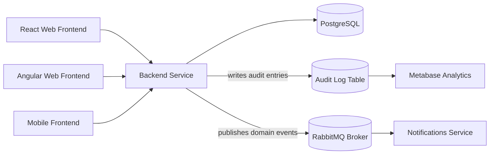

This document describes the overall system architecture for the Gift List App, including event-driven features (audit logging, messaging, analytics, notifications).


Directory Layout
```
gifti-list/
├── .github/            # CI/CD workflows (GitHub Actions)
│   └── workflows/
├── apps/
│   ├── web-react/       # React (+ Next.js) + Tailwind CSS (start)
│   ├── web-angular/     # Angular + Tailwind CSS (future)
│   ├── mobile/          # React Native + NativeWind (future)
│   └── backend/         # Spring Boot + OpenAPI + PostgreSQL
├── packages/
│   ├── ui/              # Shared UI components (web + native)
│   ├── tokens/          # Design tokens (colors, spacing, typography)
│   └── utils/           # Shared business logic and helpers
├── infra/              # Production infrastructure definitions
│   ├── k8s/             # Kubernetes manifests (kind cluster for dev)
│   └── terraform/       # IaC for cloud deployments (optional)
├── docs/               # Markdown documentation files
│   ├── index.md
│   ├── dev-setup.md
│   └── architecture.md
├── dev-tools/          # Developer tooling configurations
│   └── Tiltfile         # Tilt config for local development
```