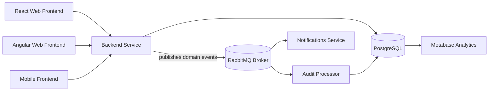

# Architecture — Gifti List App

This document describes the overall system architecture for the Gift List App.

> ⚠️ This represents the **target architecture**. Some components are not yet implemented.

---

## Overview

The system follows a **modular monolith backend** with **event-driven side effects**.

* Core business logic is handled synchronously (API → DB)
* Side effects (notifications, audit, analytics) are handled asynchronously via events

---

## High-Level Architecture


```mermaid
graph LR
WebReact[React Web Frontend]
WebAngular[Angular Web Frontend]
Mobile[Mobile Frontend]

Backend[Backend Service]
DB[(PostgreSQL)]
RabbitMQ[(RabbitMQ Broker)]

AuditProcessor[Audit Processor]
Notifications[Notifications Service]
Metabase[Metabase Analytics]

WebReact --> Backend
WebAngular --> Backend
Mobile --> Backend

Backend --> DB
Backend -->|publishes domain events| RabbitMQ

RabbitMQ --> AuditProcessor
RabbitMQ --> Notifications

AuditProcessor --> DB
DB --> Metabase
```

---

## Key Concepts

### Backend (Spring Boot)

* Handles all core business logic
* Persists data to PostgreSQL
* Publishes domain events after successful operations

---

### PostgreSQL

* Primary data store
* Stores wishlist items and core domain data
* Also used for audit/event persistence (via processors)

---

### RabbitMQ

* Message broker for asynchronous communication
* Decouples backend from side effects
* Enables event-driven architecture

---

### Audit Processor (future)

* Consumes events from RabbitMQ
* Writes audit entries to the database
* Enables traceability of user actions

---

### Notifications Service (future)

* Consumes events (e.g. item reserved, list shared)
* Sends emails / push notifications

---

### Analytics (Metabase)

* Reads from database
* Provides dashboards and insights
* No direct coupling to backend logic

---

## Architectural Principles

### 1. Synchronous Core, Asynchronous Side Effects

```text
API Request → Application → Domain → Database
                        ↓
                   Publish Event
                        ↓
               Queue → Consumers
```

* Core logic must succeed independently
* Events are published **after success**
* Consumers react independently

---

### 2. Decoupling via Events

> “Don’t call other components directly — publish an event.”

Benefits:

* Reduced coupling
* Easier extension (add new consumers)
* Better scalability

---

### 3. Feature-Oriented Backend Structure

Backend code is organized by feature:

```text
item/
  application/
  domain/
  messaging/

list/
  application/
  domain/
```

* Keeps business logic cohesive
* Avoids “technical layer soup”

---

### 4. Observability (next step)

The system will expose:

* Metrics (Micrometer + Prometheus)
* Dashboards (Grafana)
* Later: tracing (OpenTelemetry)

---

## Directory Layout

```text
gifti-list/
├── .github/            # CI/CD workflows (GitHub Actions)
│   └── workflows/
├── apps/
│   ├── web-react/       # React (+ Next.js) + Tailwind CSS (start)
│   ├── web-angular/     # Angular + Tailwind CSS (future)
│   ├── mobile/          # React Native + NativeWind (future)
│   └── backend/         # Spring Boot + OpenAPI + PostgreSQL
├── packages/
│   ├── ui/              # Shared UI components (web + native)
│   ├── tokens/          # Design tokens (colors, spacing, typography)
│   └── utils/           # Shared business logic and helpers
├── infra/               # Infrastructure & deployment configs
│   ├── k8s/             # Kubernetes manifests (future)
│   ├── terraform/       # Infrastructure as code (future)
│   └── monitoring/      # Prometheus, Grafana (future)
├── docs/
│   ├── index.md
│   ├── dev-setup.md
│   └── architecture.md
├── dev-tools/
│   └── Tiltfile         # Local dev orchestration
```

---

## Evolution Path

Current → Next → Later

* ✅ Backend API + Postgres
* ✅ RabbitMQ (basic publish/consume)
* ⏭️ Observability (metrics, dashboards)
* ⏭️ Real async use cases (notifications, audit)
* ❄️ Advanced messaging (exchanges, retries, DLQ)
* ❄️ Distributed architecture (if needed)

---

## Summary

The system is designed as:

* A **modular monolith backend**
* With **event-driven extensions**
* And **clear separation of concerns**

This allows:

* fast iteration now
* scalability later
* clean architecture growth over time
